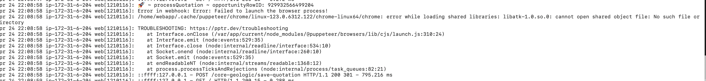
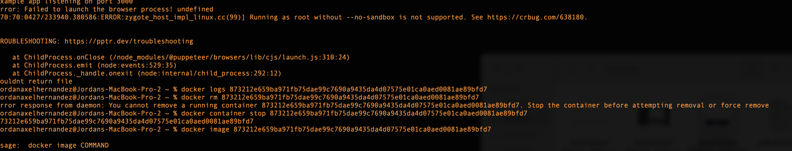
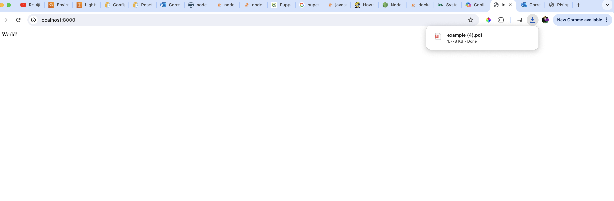

## Running Puppeteer in node.js with Amazon Linux 2023

Solving problem: /home/webapp/.cache/puppeteer/chrome/linux-123.0.6312.122/chrome-linux64/chrome: error while loading shared libraries: libatk-1.0.so.0: cannot open shared object file: No such file or directory

### Original error (Linux machine can't find):



### After installing Chrome using dnf

```docker
RUN dnf install -y https://dl.google.com/linux/direct/google-chrome-stable_current_x86_64.rpm

```



#### Looks like it cant access to chrome using this distro, so we add the --no-sandbox flag into the args in puppeteer

```javascript
    const browser = await puppeteer.launch({ headless: true, args: ['--no-sandbox'] });

```

### After doing this you should see:



### Finally generating the file without problems
